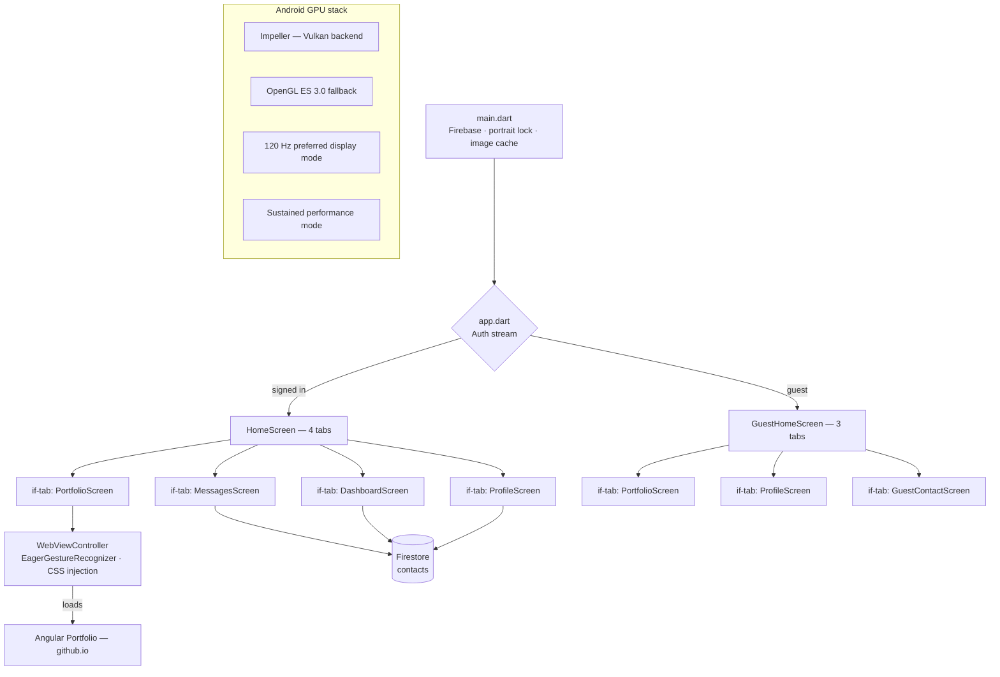

# Portfolio Admin

Flutter Android app that embeds the [Angular portfolio site](https://emmanuel1017.github.io/Angular-Resume/) in a full-screen WebView and provides an admin layer for managing availability status, reading visitor messages, and viewing dashboard analytics — all backed by Firebase.

---

## Architecture



### Tab memory model

| Tab | Strategy | Reason |
|-----|----------|--------|
| All tabs incl. WebView | `if (_tab == N)` — destroyed on leave | Fully releases GPU surface, Chromium instance, and Firestore streams on every tab switch. Android HTTP disk cache reloads the Angular site in ~300 ms on return — far cheaper than keeping a live WebView surface pinned in GPU memory at all times. |

---

## Performance decisions

### Android GPU
- **Impeller / Vulkan** (`EnableImpeller=true` in manifest) — pre-compiles all shaders at launch, eliminating JIT shader jank during scroll and animation. Automatic OpenGL ES 3.0 fallback on older SOCs.
- **Sustained performance mode** (`setSustainedPerformanceMode(true)`) — holds clocks at a thermally stable level, preventing the boost → overheat → throttle → jank cycle on mid/low-end devices.
- **120 Hz** — `preferredDisplayModeId` set to highest available refresh in `onResume`; `allow_multiple_resumed_activities=true` enables variable refresh scheduling on Android 11+.

### WebView scroll
- `EagerGestureRecognizer` on `WebViewWidget` removes the ~80 ms Flutter gesture-arena delay before scroll starts.
- CSS injection overrides `scroll-behavior: auto` (kills Angular router smooth-scroll fighting momentum); `transform: translateZ(0)` on `body` promotes the scroll container to its own GPU compositor layer.
- `content-visibility: auto` on Angular sections skips off-screen paint; `contain: layout style` on cards isolates reflows so one card's resize can't cascade.

### Flutter widget tree
- All dynamic state flows through `ValueNotifier` — the `WebViewWidget` never rebuilds; only the 2 px progress bar or unread badge re-renders.
- `RepaintBoundary` around bottom nav and top chrome isolates their paint from the WebView surface.
- `MarqueeLabel` measures text off-layout via `TextPainter`, drives scroll with `AnimatedBuilder` + hoisted child — only the `Transform` node repaints per frame.

### Release build
- R8 full mode (`android.enableR8.fullMode=true`) with `isMinifyEnabled` + `isShrinkResources` — whole-program dead-code elimination across Flutter and Firebase.
- ABI filter: `arm64-v8a` + `armeabi-v7a` only — ~30 % smaller APK, no x86 overhead on real devices.
- Parallel Gradle (`org.gradle.parallel=true`) + build caching.

---

## Project structure

```
lib/
├── main.dart                   Firebase init, orientation lock, image cache tuning
├── app.dart                    Auth stream → HomeScreen / GuestHomeScreen router
├── theme/app_theme.dart        Design tokens
├── services/
│   └── portfolio_service.dart  Firestore read/write (availability toggle, autoOn)
├── screens/
│   ├── home_screen.dart        Admin shell: 4-tab nav, unread-count stream
│   ├── guest_home_screen.dart  Guest shell: 3-tab nav
│   ├── portfolio_screen.dart   Full-screen WebView, CSS injection, section nav bar
│   ├── profile_screen.dart     Avatar, bio, availability toggle
│   ├── dashboard_screen.dart   Analytics widgets
│   ├── messages_screen.dart    Firestore contacts list (SliverList.builder, lazy)
│   └── guest_contact_screen.dart  Visitor message form → Firestore
└── widgets/
    └── marquee_label.dart      Auto-scrolling nav label (TextPainter + AnimatedBuilder)

android/
├── app/build.gradle.kts        R8, ABI filter, ProGuard config
├── app/proguard-rules.pro      Keep rules: Flutter / Firebase / WebView JS bridge
├── gradle.properties           parallel, caching, R8 full mode, Kotlin incremental
└── app/src/main/
    ├── AndroidManifest.xml     Impeller, 120 Hz, hardwareAccelerated, allow_multiple_resumed
    └── kotlin/.../MainActivity Sustained perf mode + high-refresh-rate request
```

---

## Run

```bash
# List connected devices
flutter devices

# Debug — hot reload available
flutter run -d <device-id>

# Release — Impeller + R8 active
flutter run -d <device-id> --release
```

> `google-services.json` must be placed in `android/app/` before building (not committed — contains Firebase credentials).
