<div align="center">

# Portfolio Admin

The Android companion for [my portfolio site](https://emmanuel1017.github.io/Angular-Resume/).

[](https://github.com/Emmanuel1017/My-Resume-Flutter-APP/releases/latest/download/portfolio-admin.apk)
[](https://github.com/Emmanuel1017/My-Resume-Flutter-APP/releases/latest)
[](https://emmanuel1017.github.io/Angular-Resume/)
[](https://flutter.dev)
[](https://firebase.google.com)
[](https://flutter.dev)
[](https://firebase.google.com)

</div>

---

The site already does most of what a portfolio needs. I wanted the app to do the things the site can't: get pushed when someone messages me, toggle availability without opening a laptop, and run Kori without dragging a WebGL cat and a Web Worker around on a phone.

So the app embeds the site, then carves out a handful of native screens to handle the parts that should be native.

---

## Screenshots

<table>
  <tr>
    <td align="center" width="33%">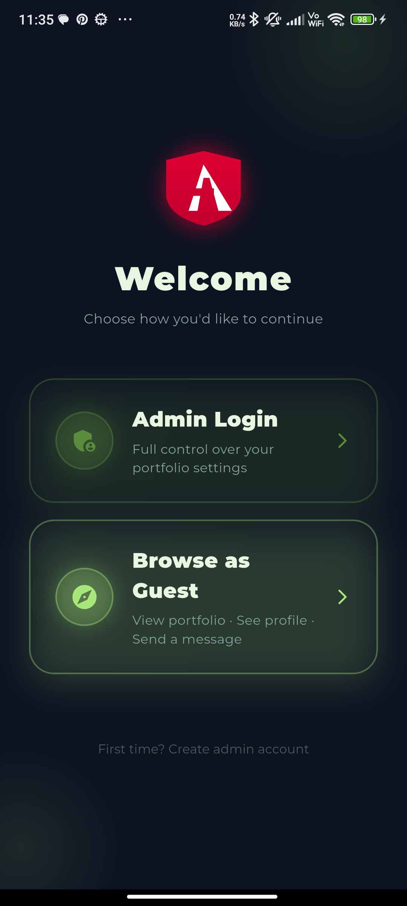<br/><sub><b>Welcome</b><br/>Sign in or browse as guest</sub></td>
    <td align="center" width="33%">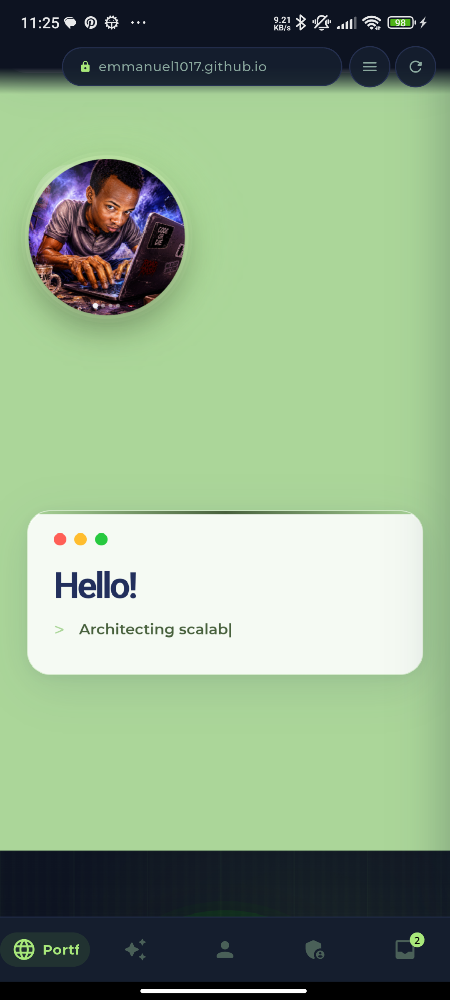<br/><sub><b>Portfolio</b><br/>Angular site, native chrome</sub></td>
    <td align="center" width="33%">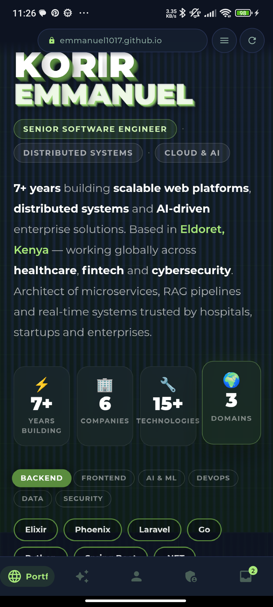<br/><sub><b>About</b><br/>Stack &middot; years &middot; domains</sub></td>
  </tr>
  <tr>
    <td align="center">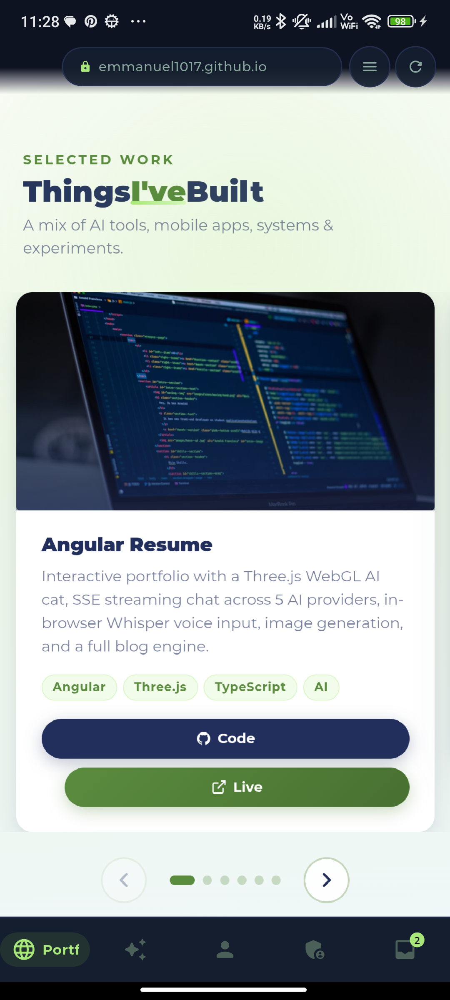<br/><sub><b>Things I&rsquo;ve Built</b><br/>Project carousel</sub></td>
    <td align="center">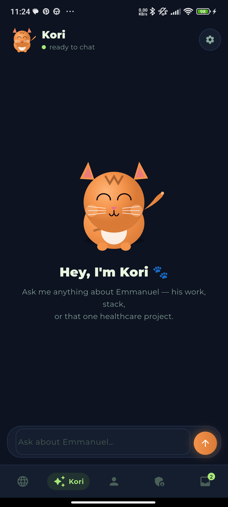<br/><sub><b>Kori</b><br/>Native chat with the cat</sub></td>
    <td align="center">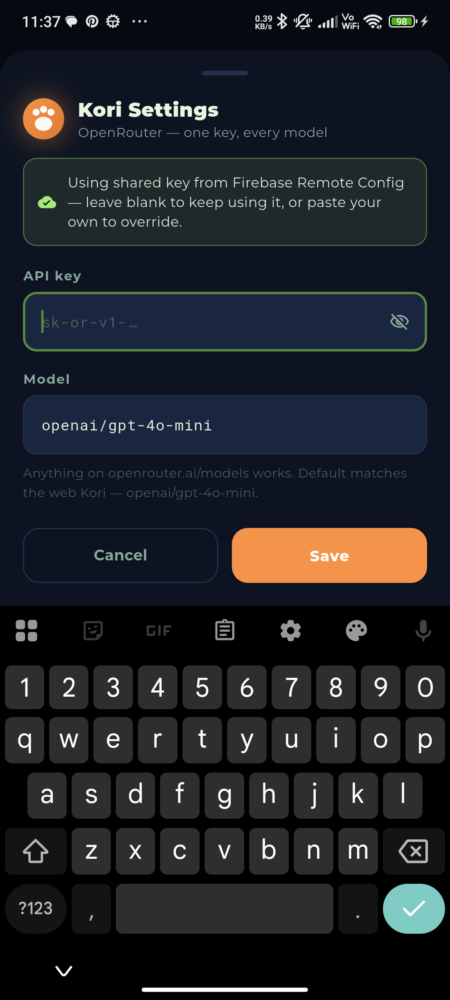<br/><sub><b>Kori Settings</b><br/>OpenRouter via Remote Config</sub></td>
  </tr>
  <tr>
    <td align="center">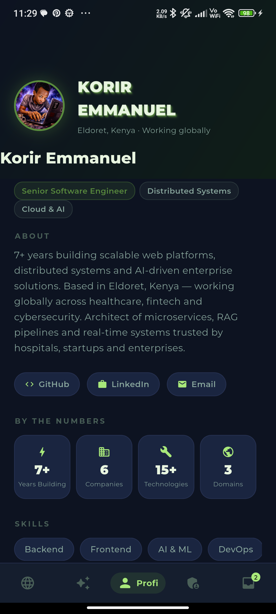<br/><sub><b>Profile</b><br/>Availability toggle &middot; bio</sub></td>
    <td align="center">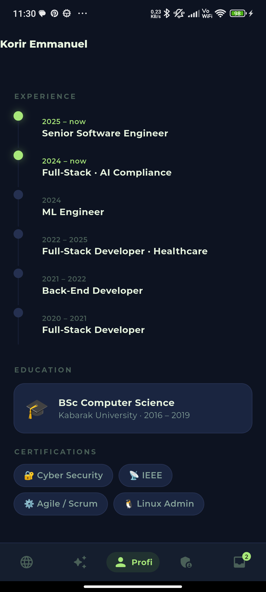<br/><sub><b>Experience</b><br/>Timeline &middot; education &middot; certs</sub></td>
    <td align="center">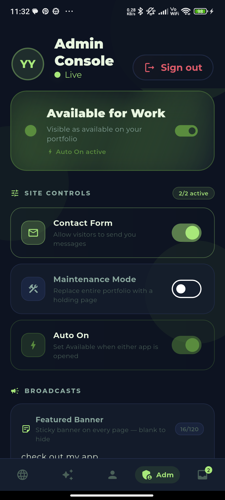<br/><sub><b>Admin Console</b><br/>Live site controls</sub></td>
  </tr>
  <tr>
    <td align="center">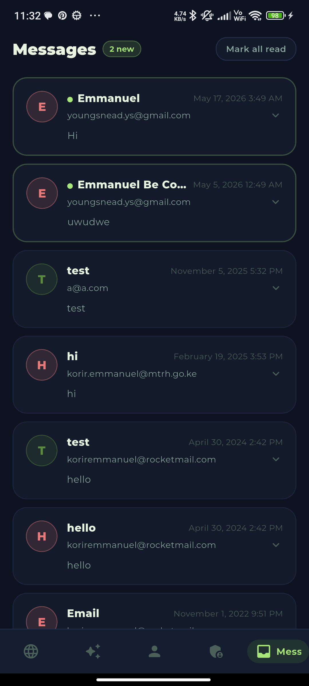<br/><sub><b>Messages</b><br/>Real-time inbox</sub></td>
    <td align="center">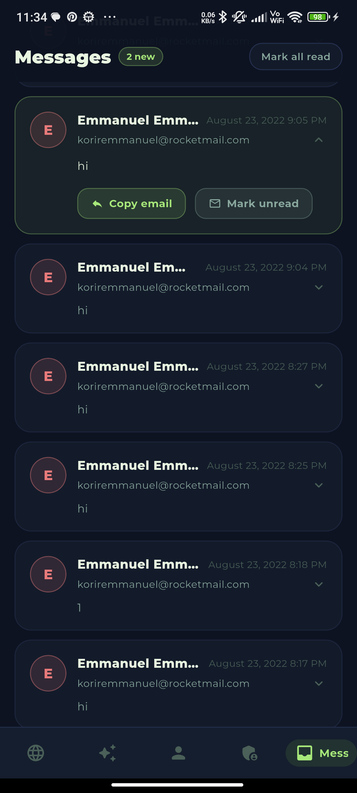<br/><sub><b>Message Detail</b><br/>Copy email &middot; mark unread</sub></td>
    <td align="center">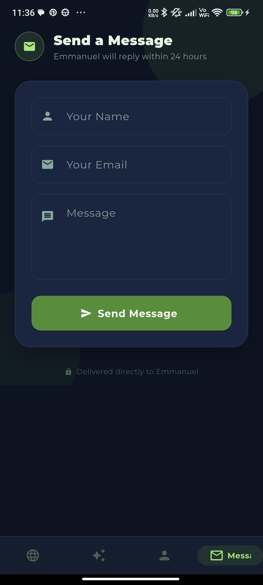<br/><sub><b>Send a Message</b><br/>Guest contact form</sub></td>
  </tr>
</table>

| Tab | What it is |
| --- | --- |
| Portfolio | The Angular site, full-screen, with native chrome on top |
| Kori | Native chat. The web's Three.js cat gets hidden in-app and replaced with a 2D one I painted in Flutter |
| Profile | Stack, contacts, availability toggle |
| Admin | Live controls (availability, contact form on/off, banner copy, etc) |
| Messages | Inbox for the contact form. Push-notified, paginated, with read state |
| Send a message | Guest-only, themed to match the rest |

---

## How it fits together

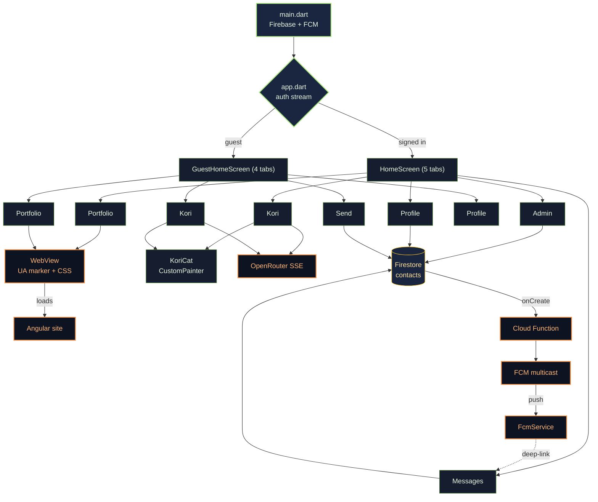

Every tab is mounted with `if (_tab == N)`, so leaving a tab destroys it. The WebView, its Chromium instance, the GPU surface, any Firestore subscriptions, Kori's chat history - all of it goes. Coming back to a tab re-mounts from scratch, and Android's HTTP disk cache reloads the Angular site in about 300 ms. That's cheaper than keeping a WebView pinned in GPU memory the whole session.

---

## Kori, natively

The web Kori is a fun thing - Three.js cat, procedural tabby texture on a CanvasTexture, a Web Worker doing in-browser Transformers.js inference if you ask it to. None of that belongs on a phone the user is already running my app on.

So inside the WebView, I tag the user-agent and inject a flag:

```dart
_ctrl.setUserAgent('... PortfolioAdminFlutter/1.0 ...');
_ctrl.runJavaScript('window.__FLUTTER_APP__ = true;');
```

Angular sees the flag and skips rendering `<app-agent>` entirely. The WebView gets a defensive `display: none !important` on it too, in case the JS arrives late. That's a couple of megs of JS, a worker thread, and a WebGL canvas that simply never load.

In its place there's a native tab with two pieces:

**The cat** lives in `lib/widgets/kori_cat.dart`. One `CustomPainter`, same orange palette as the web cat (`#F4934A` / `#D97A37`). It breathes on a 4-second sine, the tail wags at 2 Hz, ears twitch independently, blinks happen at random 2.5-5.5 second intervals. There's a forehead M-marking, whiskers, paw highlights. Tap it and it boops - a quick squish plus a surprised expression. One master `AnimationController` drives everything, two short ones handle blink and boop. The whole thing sits inside a `RepaintBoundary` so it costs nothing when other parts of the screen redraw.

**The chat** is `lib/screens/kori_screen.dart`. Plain `http.Client` posting to OpenRouter with `stream: true`, then parsing `data:` lines straight off the byte stream as they arrive. The system prompt is lifted from the Angular service, same cat persona, same biographical facts. Default model is `openai/gpt-4o-mini` and I carry the same stale-model migration list as the web - anyone who saved one of the now-broken `:free` models gets quietly bumped onto the working default next open.

The API key resolves the same way as on the web: a user-pasted key wins, otherwise we fall back to `openrouter_api_key` from Firebase Remote Config. That means I can change one key in the console and every signed-in admin device picks it up on next launch.

---

## Push, from form to phone

When someone submits the contact form on the site - or via the guest screen in the app - a doc lands in `/contacts/{id}`. From there:

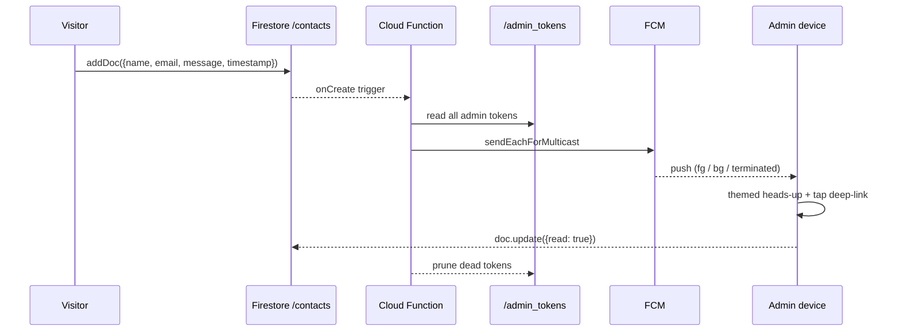

The Cloud Function (`functions/index.js`) listens to `onDocumentCreated('contacts/{id}')`, reads every token in `/admin_tokens`, fires a multicast, and prunes anything FCM rejects with `registration-token-not-registered`. That keeps the token list from rotting over time without a separate cron.

The Flutter side is `lib/services/fcm_service.dart`. The background isolate handler is a top-level function (it has to be - the OS spawns a fresh isolate for it). Foreground messages get rendered locally by `flutter_local_notifications` so the heads-up still appears while the app is open - FCM doesn't draw banners when your app is in the foreground, you have to do it yourself. Background and terminated taps route to the Messages tab via a tiny `ValueNotifier<int?>` that `HomeScreen` reads on next build.

Tokens persist to `/admin_tokens/{token}` when an admin signs in and get deleted on sign-out, so logging out actually stops the pushes. Guests never write a token, so they never get notified.

Deploy once:

```bash
cd functions
npm install
firebase use --add
firebase deploy --only functions:notifyAdminsOnNewContact
```

You need the Blaze plan for any Cloud Function in 2025+, but the function itself stays comfortably within the free tier (2M invocations/month).

---

## Why messages feel fast

The first version of the inbox stuttered on a long list and dropped any contact saved before I added the `timestamp` field. Three fixes:

The `orderBy('timestamp', desc)` server-side query was silently filtering out every doc missing the field. That includes all of my pre-2023 contacts. I dropped the orderBy, fetched up to 300 rows, and sort client-side by `Timestamp` with a fallback to parsing the legacy `date` string.

Tapping a card used to call `setState` on the screen, which rebuilt the whole `ListView`. Now expansion lives in a `ValueNotifier<String?>` holding the open doc's id. Only the two affected cards rebuild.

Each row gets its own `RepaintBoundary` and a memoized wrapper (`_MsgRow`) caches the sort key and read flag across snapshots. The visible list is windowed - 60 rows initial, "Load older" bumps it by 40 - so the underlying Firestore stream stays real-time but the `ListView.builder` only walks what's on screen.

Pull-to-refresh resets the window. There's a "Mark unread" and a "Copy email" inside the expanded card.

---

## The web side, in passing

Outside the WebView the Angular site grew three small things to point at the app:

- A sticky orange banner above the header that slides in after the hero animation, dismissible with a close button (saved in `localStorage`). Tapping it scrolls to the screenshots section. It publishes its measured height to `--promo-banner-height`, and the floating header reads that with `top: calc(14px + var(--promo-banner-height, 0px))` so they move together instead of overlapping.
- A pulsing orange "Get the App" pill in the nav.
- A new `<app-screenshots>` section with a phone-mockup carousel of 12 shots, a Download APK button, and a View source button.

Inside the WebView all three are hidden by the UA sniff and a belt-and-braces CSS injection, so they never render twice.

---

## Perf notes worth keeping

<details>
<summary><strong>Android GPU</strong></summary>

`EnableImpeller=true` in the manifest turns on Vulkan with AOT shader compilation, which kills the JIT shader jank Flutter used to have on first paint. OpenGL ES 3.0 is the automatic fallback on older SoCs.

`setSustainedPerformanceMode(true)` in `MainActivity.onCreate` holds the CPU/GPU clocks at a thermally stable level. Stops the boost-throttle-jank cycle on mid-range phones.

`allow_multiple_resumed_activities=true` lets the OS variable-refresh on Android 11+, and `preferredDisplayModeId` picks the highest available - 120 Hz on the phones that have it.
</details>

<details>
<summary><strong>WebView scroll</strong></summary>

`EagerGestureRecognizer` on the WebView claims touches immediately instead of waiting for Flutter's gesture arena, which removes about 80 ms of "is this a scroll?" latency before the page actually moves.

Injected CSS overrides Angular's smooth scroll (`scroll-behavior: auto !important`), adds `transform: translateZ(0)` on body to promote the scroll container to its own GPU layer, and applies `content-visibility: auto` to long sections so off-screen ones skip paint entirely. Cards get `contain: layout style` so a resize on one card can't reflow its siblings.

Heavy components that have native counterparts (`app-agent`, `.screenshots-section`, `.promo-banner`, `.get-app-cta`) get `display: none !important` in the injection too. Belt and braces - even if the UA detection in Angular missed.
</details>

<details>
<summary><strong>Flutter widget tree</strong></summary>

The `WebViewWidget` never rebuilds. Every piece of dynamic chrome around it (progress bar, back button, section pills, unread badge) is driven by a `ValueNotifier`, so only that tiny widget repaints when its value changes. `RepaintBoundary` wraps the bottom nav, top chrome, each Kori cat, and each message card.

`MarqueeLabel` measures off-layout with a `TextPainter` and animates a single `Transform` via `AnimatedBuilder` with a hoisted child, so it's one paint per frame even when multiple labels are scrolling.

Kori chat history is in-memory. Tab teardown cancels the stream subscription, closes the HTTP client, disposes the controllers, and the cat's animation controllers go with it.
</details>

<details>
<summary><strong>Release build</strong></summary>

R8 full mode is on (`android.enableR8.fullMode=true`), with `isMinifyEnabled` + `isShrinkResources`. That gives whole-program dead-code elimination across Flutter, Firebase, and FCM.

Core library desugaring is enabled because `flutter_local_notifications` needs it - backports `java.time` onto older Android via `desugar_jdk_libs:2.1.4`.

ABI filter is `arm64-v8a + armeabi-v7a` only. Drops about 30% off the APK and there's no x86 hardware out there that benefits from a third build.

Gradle is parallel and caching is on (`gradle.properties`).
</details>

---

## Project layout

```text
lib/
|-- main.dart                       Firebase + FCM init, navigatorKey, pendingHomeTab
|-- app.dart                        Auth stream router
|-- theme/app_theme.dart            Design tokens
|-- services/
|   |-- portfolio_service.dart      Firestore: availability toggle, autoOn
|   `-- fcm_service.dart            Token persistence, heads-up, deep-link routing
|-- screens/
|   |-- home_screen.dart            Admin shell (5 tabs)
|   |-- guest_home_screen.dart      Guest shell (4 tabs)
|   |-- portfolio_screen.dart       WebView, UA marker, CSS injection, section nav
|   |-- kori_screen.dart            Native chat - OpenRouter SSE, Remote Config key
|   |-- profile_screen.dart         Avatar, bio, availability toggle
|   |-- dashboard_screen.dart       Admin controls, sign-out clears FCM token
|   |-- messages_screen.dart        Paginated inbox, ValueNotifier expansion
|   |-- guest_contact_screen.dart   Visitor message form
|   `-- splash / login / create_admin
`-- widgets/
    |-- kori_cat.dart               2D animated cat
    `-- marquee_label.dart          Auto-scrolling nav label

functions/
|-- index.js                        notifyAdminsOnNewContact
`-- package.json                    firebase-admin + firebase-functions v6

android/
|-- app/build.gradle.kts            R8, ABI filter, ProGuard, desugaring
|-- app/proguard-rules.pro          Flutter / Firebase / WebView keep rules
|-- gradle.properties               parallel, caching, R8 full mode
`-- app/src/main/
    |-- AndroidManifest.xml         Impeller, 120 Hz, FCM permissions, default channel
    |-- res/values/colors.xml       notification_accent (mint green)
    `-- kotlin/.../MainActivity     Sustained perf, high refresh request

ios/ - windows/ - linux/            Platform scaffolds; Firebase config still needed
```

---

## Install

| Platform | How | Notes |
| --- | --- | --- |
| **Android** | Download the [latest APK](https://github.com/Emmanuel1017/My-Resume-Flutter-APP/releases/latest/download/portfolio-admin.apk) and side-load (`adb install -r portfolio-admin.apk`). | The native, full-featured build. FCM push + Firestore + Kori cat all live. |
| **iOS** | Download the [unsigned `.app` zip](https://github.com/Emmanuel1017/My-Resume-Flutter-APP/releases/latest) and re-sign with your own Apple Developer cert. Or clone, drop `GoogleService-Info.plist` into `ios/Runner/`, open in Xcode, set your signing team, then `flutter build ipa --release`. | Apple won't let unsigned IPAs install over Safari, so the release just ships the `.app` for re-signing. |
| **Windows** | Install the [portfolio site as a PWA](https://emmanuel1017.github.io/Angular-Resume/) from Edge or Chrome ("Install Korir Portfolio"). | Flutter's official Firebase desktop plugins don't ship Release-mode Windows libraries yet, so a native Windows build is blocked upstream. The PWA install is genuinely first-class: standalone window, app-list entry, themed window chrome. |
| **Linux** | Same as Windows &mdash; install as a PWA from Chrome/Firefox. Or `flutter build linux --release` if you've already stripped out the Firebase plugins for your fork. | Same upstream gap. The PWA path is the recommended one until Firebase Linux desktop ships. |

## Running from source

```bash
flutter pub get
# Drop your google-services.json into android/app/ (not committed)

flutter devices                                              # list connected
flutter run -d <device-id>                                   # debug, hot reload
flutter run -d <device-id> --release                         # release build

# Or build and side-load
flutter build apk --release
adb install -r build/app/outputs/flutter-apk/app-release.apk
```

---

## Visits

There's a `/visits` collection that gets one append per browser session (Angular) or one per cold start (Flutter). The append captures everything we can reasonably pull without a third-party tracker: the IP and what `ipapi.co` returns for it (city, country, ISP, ASN, lat/long, timezone), the user agent, screen + viewport size, language, referrer, connection type, and which surface fired it (`web`, `flutter-admin`, `flutter-guest`). The Admin Console has an Insights -> Visits card that pushes into a full screen showing every row with summary metrics (Today / 7d / 30d / All-time / unique IPs / top country / top city) and an expandable detail panel per visit.

Privacy posture: IPs land in Firestore and stay there. Rules let anyone create a visit row but only signed-in admins read them. No third-party trackers, no cookies, no Analytics PII push.

---

## Deploy

Two release paths, complementary:

### A. GitHub Actions (recommended for clean cross-platform)

Tag a release and the [`release-multiplatform.yml`](.github/workflows/release-multiplatform.yml) workflow takes over:

```bash
git tag v1.2.0
git push origin v1.2.0
```

That fires three parallel build jobs: **Android** on `ubuntu-latest`, **iOS** on `macos-latest` (unsigned `.app` zip), **Linux** on `ubuntu-latest` (skips gracefully if Firebase Linux libs aren't ready). When they're done a fourth job attaches the artifacts to the matching GitHub Release (creating it if needed). Re-running on the same tag clobbers existing assets, so it's safe to retry.

You can also fire it manually from the Actions tab via `workflow_dispatch` with an optional `tag` input.

### B. Local one-shot (Android-first)

```bash
export GITHUB_TOKEN=ghp_...      # PAT with `repo` scope
dart run tool/deploy.dart        # auto-bumps the patch of the latest tag
```

Flags:

```text
--tag v1.2.3       force a specific tag
--android-only     skip desktop builds
--no-upload        build artifacts but don't push to GitHub
--notes "..."      release body
```

Builds Android always, plus Windows zip (on Windows hosts) or Linux tarball (on Linux hosts), then uploads. Handles the 422-already-exists case by deleting and re-uploading.

### Per-platform

```bash
flutter build apk --release        # Android
flutter build windows --release    # Windows  (needs Visual Studio C++ workload)
flutter build linux   --release    # Linux    (needs GTK + Clang)
flutter build macos   --release    # macOS    (needs Xcode)
flutter build ipa     --release    # iOS      (needs Xcode + Apple Developer)
```

iOS deliberately can't be cross-built from Windows or Linux. Run the iOS build on a Mac with `flutter build ipa --release`, sign with your Apple Developer team in Xcode, then drag the `.ipa` onto the v1.x release manually or `gh release upload v1.x ./build/ios/ipa/portfolio-admin.ipa`.

### Firestore rules + Cloud Function

```bash
firebase deploy --only firestore:rules
firebase deploy --only functions:notifyAdminsOnNewContact
```

Both ship the rules in `firestore.rules` (visits/admin_tokens/contacts/settings) and the FCM fan-out function. Blaze plan required for the function; rules are free.

---

## Remote Config keys

| Key | Used by | Notes |
| --- | --- | --- |
| `openrouter_api_key` | Web Kori + Flutter Kori | Shared key. Leave empty to force per-user keys. |
| `available_for_work` | Angular `PortfolioSettingsService` | String `'true'` / `'false'`. |

---

No `google-services.json`, `GoogleService-Info.plist`, or Firebase service-account JSON is committed to either repo. Add them locally before building.
